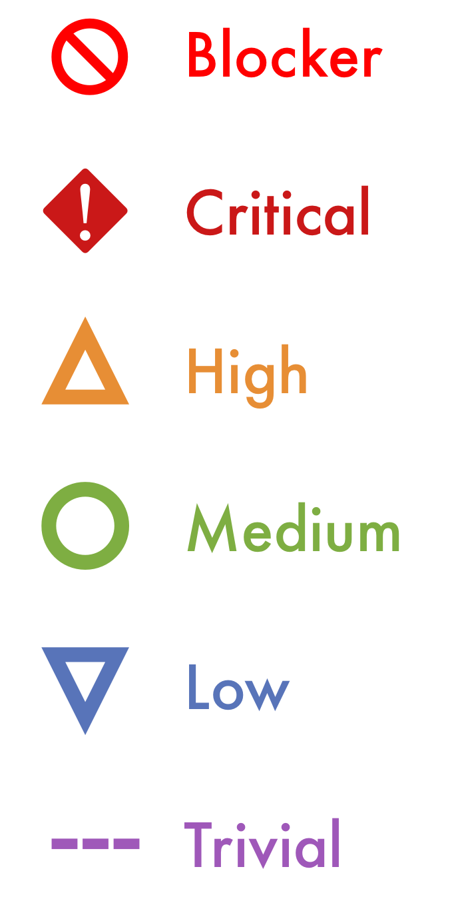

# Content types

Artikel (6 min)

Video (7 min)

Online kurs (60 min)

Tutorial (3 min)

**Total**:

- Artiklar: 5 stk, total 35 min
- Video: 6 stk, total 37 min
- Online kurs: 1 stk, 60 min
- Total: 132 min

# Priorities

## Blocker

&#128683; blocker

 `&#128683;`

## Critical

&#9888; critical

 `&#9888;`

## High
&#9651; high

 `&#9651;`

## Medium

&#9711; medium

 `&#9711; `

## Low
&#9661; low

 `&#9661;`

## Trivial
&#12336; trivial

 `&#12336;`

# Logos

## Teams

``

``

## Discord

``

``

# Todo

Check if custom emjoes can be made, replace HTML code

https://docs.github.com/en/enterprise/2.13/user/articles/emoji-on-github-pages

https://github.com/jekyll/jemoji#customizing

